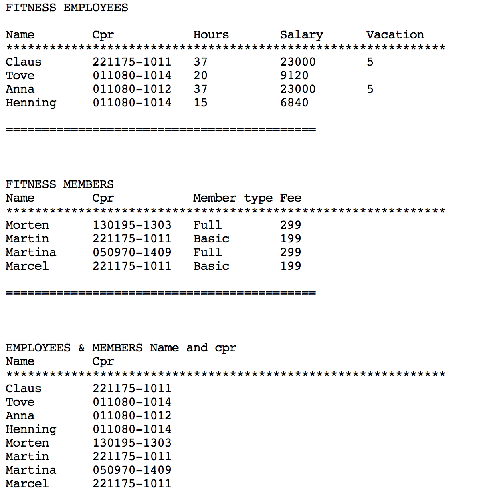

# Fitness Repetition Exercise

In this exercise you are going to make a program that can show lists of Employees and members of a Fitness Club.

## Employees

There are 2 types of Employees:

    * Administration
    * Instructors

The administration personnel are employed full time (37 hours a week), and all have a fixed salary of 33000kr a month, and have 5 weeks of vacation a year.     

Instructors are hired on an hourly basis, and are payed 199kr per hour. They don't have any paid vacation.    

## Members

The members can have 2 types of membership    

    * Basic
    * Full The Basic membership costs 199.- a month, and the Full membership 299,-

You should make a console program that makes use of inheritance and polymorphism and that can print out something like the following:    

    

You are allowed to work in groups, but each one of you have to code your own program.    

When you have finished your program, you should push it to github and submit a link to this repository on [Fronter](https://kea-fronter.itslearning.com/LearningToolElement/ViewLearningToolElement.aspx?LearningToolElementId=779730).    
(Note: It is not required of you to hand it in, but it would be nice for me to see what you did.     
- You do also not get personal feedback on this exercises).

